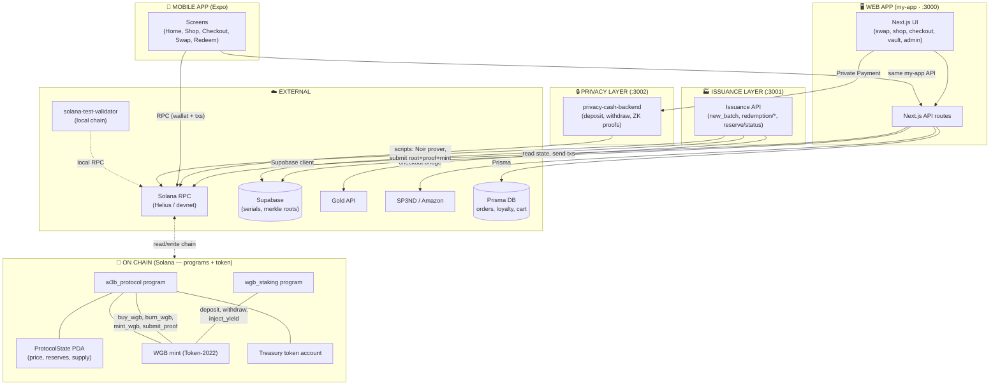

# GoldBack Project ($W3B) - Sovereign RWA Standard

> **The World's First Privacy-Preserving Real World Asset (RWA) Platform on Solana**

This project bridges the gap between **Physical Sound Money (Goldbacks)** and **Digital Velocity (Solana)**, creating a circular economy where users can earn, trade, and spend gold without surveillance.

---

## 🏗️ The Technology Stack

We leverage deep-tech integrations to solve the "Trilemma of RWAs" (Scalability, Trust, Privacy):

| Feature | Tech Provider | Purpose |
|---------|---------------|---------|
| **High-Performance Network** | **Helius RPC** | Powers our sub-second swaps and real-time asset indexing. |
| **Sacred Issuance** | **Noir (Zero-Knowledge)** | Cryptographically proves `Vault Assets >= Token Supply` without revealing serial numbers. |
| **Privacy Cash** | **ZK-SNARKs** | Enables private consumption. Users can spend gold without exposing their wallet history. |
| **Consumption Bridge** | **SP3ND Integration** | Allows users to buy anything on Amazon using $W3B/USDC directly. |

---

## 🛠️ Project Structure

This monorepo contains the entire ecosystem:

- **`mobile-app/`**: **The Android Submission**
  - Native Expo/React Native mobile app with a checked-in `android/` project.
  - Contains the Gold Collection commerce flow, mobile checkout, wallet entry, and mobile Web3 surfaces.
  - *Use this folder for the hackathon Android APK deliverable.*

- **`w3b-token/`**: **The Issuance Layer**
  - Contains the Solana Smart Contract (Anchor), Noir ZK Circuits, and the Serial Number Registry.
  - *Run here to mint tokens and generate reserve proofs.*

- **`my-app/`**: **The Consumption Layer (Frontend)**
  - The Next.js 16 Web App. Contains the Swap UI, Goldback Shop, and Amazon Bridge.
  - *Run here to use the app.*

- **`privacy-cash-backend/`**: **The Privacy Layer**
  - A specialized backend that generates spend-proofs for the "Privacy Cash" feature.
  - *Run here to enable private payments.*

- **`mock-mwa-wallet/`**: **Mock MWA Wallet (mobile testing)**
  - Clone of [Solana Mobile Mock MWA Wallet](https://github.com/solana-mobile/mock-mwa-wallet). Build and install on an Android emulator to test wallet connect and signing without a real wallet app.
  - *See "Testing the mobile app with Mock MWA Wallet" below and `mobile-app/docs/mock-mwa-wallet-testing.md`.*

---

## 📐 Current State: Component Diagram

### 1. What lives where

- **On-chain (Solana)** = the “contracts”: programs and token. No HTTP APIs; everything is via RPC (read accounts, send transactions).
- **Web app** = Next.js app (UI + its own API routes). Calls Solana RPC from the browser and from the server; calls Privacy backend for Private Payment only.
- **Mobile app** = Expo app. Uses the **same** my-app API and **same** Solana RPC as the web app (same WGB program/mint). Does not call Issuance API or Privacy backend.
- **Token (WGB)** is minted on Solana by `w3b_protocol`. Web and mobile both use the same program ID and mint address (from env) and talk to Solana RPC to read balance and send `buy_wgb` / `burn_wgb` (and redeem) transactions.

### 2. Architecture overview



### 3. APIs used by each client

| Client | Calls | Purpose |
|--------|--------|--------|
| **Web (browser)** | **my-app API** | `/api/goldback-rate`, `/api/health/pricing`, `/api/sol-price`, `/api/protocol-status`, `/api/checkout/direct/create`, `/api/checkout/direct/confirm`, `/api/loyalty/balance`, `/api/redemption/create`, `/api/redemption/status`, `/api/admin/auto-verify`, `/api/user/profile`, `/api/user/cart`, `/api/orders`, `/api/sp3nd/checkout`, `/api/coinbase-onramp`, `/api/chat` |
| **Web (browser)** | **Privacy backend** | `/api/deposit`, `/api/withdraw`, `/api/deposit/create`, `/api/deposit/submit`, `/api/deposit/balance`, `/api/hot-wallet-address` — only when user chooses Private Payment at checkout |
| **Web (browser)** | **Solana RPC** | Read ProtocolState, WGB balance, build/send `buy_wgb`, `burn_wgb`, redeem txs (via wallet) |
| **Mobile** | **my-app API** | Same as web: checkout create/confirm, loyalty, redemption, catalog, portfolio, auth (via `EXPO_PUBLIC_API_BASE_URL` → my-app) |
| **Mobile** | **Solana RPC** | Same as web: wallet connect, read state, WGB balance, swap/burn txs (via `EXPO_PUBLIC_RPC_ENDPOINT`, same WGB program/mint as web) |
| **Operator / scripts** | **Issuance API** | `POST /api/v1/goldback/new_batch`, `GET /api/v1/redemption/pending`, `GET /api/v1/redemption/status/:wallet`, `PATCH /api/v1/redemption/:id/claim|confirm|cancel`, `GET /api/v1/reserve/status` — plus CLI scripts: `generate-prover`, `prove-batches`, `submit-proof` |

### 4. How the token connects to web and mobile

- **WGB is issued on Solana** by the `w3b_protocol` program (mint, treasury, ProtocolState). Issuance flow: physical serials → Supabase → Issuance API + Noir prover → scripts submit Merkle root + proof on-chain → `mint_wgb` tops up the treasury.
- **Web and mobile** both use the **same** WGB program ID and mint address (from `NEXT_PUBLIC_WGB_*` / `EXPO_PUBLIC_WGB_*`). They do **not** call the Issuance API. They:
  - **Read**: Solana RPC to get ProtocolState, user WGB balance, price (or via my-app’s `/api/goldback-rate`, which uses RPC/DB).
  - **Write**: Build and send transactions (e.g. `buy_wgb`, `burn_wgb`) through the user’s wallet to the same `w3b_protocol` program.
- So the token is “connected” to both apps by **shared chain + program + mint** and **RPC**; the Issuance API is only for **minting and operator flows**, not for normal web/mobile users.

### 5. Component summary

| Component | Port | Contains | Used by |
|-----------|------|----------|--------|
| **On-chain** | — | `w3b_protocol`, `wgb_staking`, WGB mint, ProtocolState, treasury | Everyone via RPC |
| **my-app** | 3000 | Next.js UI + API routes, Prisma | Web UI, Mobile app |
| **privacy-cash-backend** | 3002 | Deposit/withdraw, ZK proofs | Web only (Private Payment) |
| **Issuance API** | 3001 | new_batch, redemption CRUD, reserve status; drives Noir + submit-proof | Operator, scripts |
| **solana-test-validator** | — | Local chain | RPC (when using local) |

---

## 🚀 Detailed Setup & Run Instructions

To run the full platform, you must configure the environment and start 4 simultaneous services.

### 0. Prerequisites

Ensure you have the following installed:
- **Node.js** v20+
- **Rust & Cargo**
- **Solana CLI**
- **Anchor CLI**
- **Noir (`nargo`)**: Required for ZK proofs.
  ```bash
  curl -L https://raw.githubusercontent.com/noir-lang/noirup/main/install | bash
  ```

### 1. Environment Configuration

You must set up `.env` files in two locations:

#### A. W3B Token (Issuance)
```bash
cd w3b-token
cp .env.example .env
```
Fill in your keys:
- `SUPABASE_URL` / `SUPABASE_ANON_KEY`: Your database for gold serial numbers.
- `GOLDAPI_API_KEY`: For real-time gold price fetching.
- `SOLANA_RPC_URL`: Your **Helius** RPC endpoint.

#### B. Privacy Cash Backend
```bash
cd privacy-cash-backend
cp .env.example .env
```
Fill in your keys:
- `SOLANA_RPC_URL`: Your **Helius** RPC endpoint (critical for high-speed ZK proof submission).

---

### 2. Run the Full Stack

Open **4 separate terminal windows** and follow these commands exactly.

#### Terminal 1: The Local Blockchain
Start the validator to simulate the Solana network.
```bash
solana-test-validator --reset
```

#### Terminal 2: The Physical Oracle (Issuance)
This service manages the Goldback serial numbers and generates the "Reserve Proofs" (Noir).
```bash
cd w3b-token/services/api
npm install
npm run dev
```
*Runs on Port 3001.*

#### Terminal 3: The Privacy Backend (Consumption)
This service handles the ZK "Privacy Cash" transactions.
**⚠️ CRITICAL: Force POST 3002 to avoid conflict with Issuance service.**
```bash
cd privacy-cash-backend
npm install
PORT=3002 npm run dev
```
*Runs on Port 3002.*

#### Terminal 4: The Frontend (The App)
The user interface. We point it to our local Privacy Backend (Port 3002).
```bash
cd my-app
npm install
# Override the privacy API URL for local testing
NEXT_PUBLIC_PRIVACY_CASH_API=http://localhost:3002 npm run dev
```
*Runs on Port 3000.*

---

### 3. Testing the mobile app with Mock MWA Wallet

The repo includes a clone of the [Solana Mobile Mock MWA Wallet](https://github.com/solana-mobile/mock-mwa-wallet) so you can test wallet connect and signing on an emulator without a real wallet app.

#### One-time setup

1. **Android SDK**: Ensure `ANDROID_HOME` is set (e.g. `export ANDROID_HOME=$HOME/Library/Android/sdk` on macOS).

2. **Build and install the mock wallet** (from repo root):

   ```bash
   # Create local.properties if missing
   echo "sdk.dir=$HOME/Library/Android/sdk" > mock-mwa-wallet/local.properties

   cd mock-mwa-wallet
   ./gradlew assembleDebug
   cd ..
   adb install -r mock-mwa-wallet/app/build/outputs/apk/debug/app-debug.apk
   ```

3. **Run the GoldBack mobile app** (Expo dev client) on the same emulator — see `mobile-app/README.md` for env and `npm run android:dev-client`.

#### Test flow

1. Start the emulator with **GoldBack** and **Mock MWA Wallet** both installed.
2. Open **Mock MWA Wallet** and tap **Authenticate** (enables signing for 15 minutes).
3. Open the **GoldBack app** and trigger wallet connect (e.g. Connect Wallet or Sign in).
4. Approve the authorization in the Mock MWA Wallet when prompted; then signing from GoldBack will use the mock wallet.

For optional devnet SOL (specific key), troubleshooting, and references, see **`mobile-app/docs/mock-mwa-wallet-testing.md`**.

---

## 🔮 Core Features to Explore

### 1. Direct Crypto Settlement
Go to the **Shop**. Add a Goldback to your cart. Pay with **USDC** or **SOL**.
- **Why?** Instant settlement (T+0). No chargebacks. 0% "Middleman Tax".

### 2. Privacy Cash
At checkout, select **"Private Payment"**.
- **Why?** It generates a ZK proof on your machine, shielding your identity from the merchant. It restores the dignity of cash to the digital age.

### 3. Amazon Bridge
Paste an Amazon URL into the search bar.
- **Why?** It proves that Goldbacks are money. You can exit the gold ecosystem directly into real-world goods without touching a bank.

---

> **Advanced Usage**: See `w3b-token/README.md` for detailed instructions on generating new Merkle Roots and submitting ZK proofs using the batched prover.
